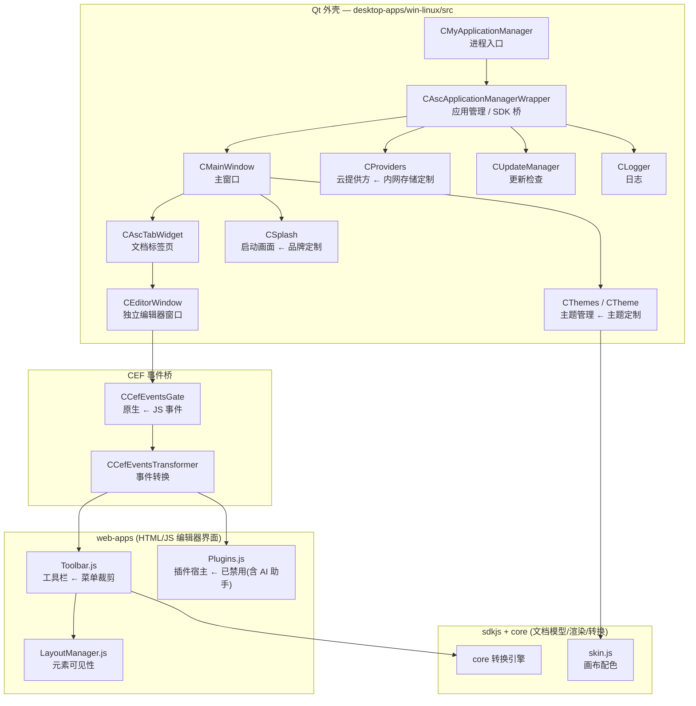

# LightOffice 开发者指南 (Developer Guide)

LightOffice 是 ONLYOFFICE Desktop Editors 的内网定制版。本仓库**不 fork 上游源码**，
而是维护一层可幂等应用的 overlay：所有定制都通过 `scripts/apply_overlay.sh`
打进上游检出目录，每处改动都带 `LIGHTOFFICE-OVERLAY` 标记，
因此跟进上游新版本时只需重新 clone + 重放 overlay。

## 1. 仓库结构

```
lightoffice/
├── code_index.json          # 所有定制点的路径索引（由脚本生成并校验存在性）
├── overlay/                 # 注入上游树的文件
│   ├── web-apps/…/themes/theme_lightwps.json
│   ├── branding/            # splash / 图标 / About logo
│   ├── desktop-apps/…/version_p.h        # 二进制品牌字符串
│   ├── desktop-apps/…/providers/lightoffice/   # 内网云提供方
│   └── build/lightoffice_size_opt.{pri,cmake}  # 体积优化编译配置
├── scripts/                 # bootstrap / overlay / 优化 / 校验
├── deploy/                  # 内网 Nextcloud + Document Server 编排
├── tests/                   # 冒烟与协同测试
└── docs/
```

## 2. 上游架构与我们的切入点

上游桌面端是一个 Qt 外壳：它用 CEF 承载 `web-apps` 的 HTML/JS 编辑器界面，
文档模型与渲染在 `sdkjs` + `core` 中完成。下图中的 `C*` 类均来自
`desktop-apps/win-linux/src/`，可用 `grep -r "class CXxx" desktop-apps/win-linux/src`
逐一核对。



### 定制点速查

| 需求 | 文件 | 机制 |
|---|---|---|
| 配色主题 | `web-apps/…/themes/theme_lightwps.json` | 覆盖 `colors-table.less` 中的 `:root` CSS 变量；`canvas-*` 由 `sdkjs/common/skin.js` 直接消费 |
| 菜单裁剪 | 四个编辑器的 `app/controller/Toolbar.js` | 将协作页签 `setVisible('review', false)` |
| 移除 AI 助手 | `web-apps/…/lib/controller/Plugins.js` | AI 助手是插件而非内置 UI，禁用插件宿主即可移除 |
| 二进制品牌 | `desktop-apps/win-linux/src/prop/version_p.h` | 上游自带的 vendor 覆盖钩子（原用于 `__NCT` 构建） |
| 启动画面/图标 | `desktop-apps/win-linux/res/` | 由 `scripts/gen_branding.py` 生成，可复现 |
| 内网云 | `desktop-apps/common/loginpage/providers/lightoffice/` | 新增 provider + `lightoffice-cloud.js` 默认地址 |
| 体积优化 | `desktop-apps/win-linux/defaults.pri` | include 体积优化 `.pri`（`-Os` / `--gc-sections` / `-Wl,-s`） |

## 3. 构建系统的重要事实

**上游使用 qmake，不是 CMake。** 整棵树有 137 个 `.pro`、57 个 `.pri`，
而 `CMakeLists.txt` 只有 32 个（其中 27 个属于 `desktop-sdk`）。
因此体积优化配置的主入口是 `lightoffice_size_opt.pri`；
`lightoffice_size_opt.cmake` 仅用于 `desktop-sdk` 那部分 CMake 目标。

官方构建入口是独立仓库 `ONLYOFFICE/build_tools`（不是 DesktopEditors 的子模块）：

```bash
git clone --depth 1 https://github.com/ONLYOFFICE/build_tools.git
cd build_tools/tools/linux && ./automate.py desktop
```

`automate.py` 会依次：自举一个私有 python3 → apt 安装约 40 个依赖 →
拉取预编译 Qt 5.9.9 → 拉取 ubuntu16 sysroot → 编译 core/sdkjs/desktop。

## 4. 本地开发流程

```bash
scripts/bootstrap.sh              # clone 上游 + 子模块
scripts/apply_overlay.sh          # 打入定制
scripts/apply_build_flags.sh      # 打入体积优化编译配置
scripts/trim_dictionaries.sh      # 裁剪词典
scripts/optimize_assets.sh        # 压缩静态资源（--lossy 可选）
scripts/verify_ac.sh              # 逐条核对验收标准
```

查看 overlay 到底改了什么：

```bash
git -C /home/user/onlyoffice-src submodule foreach 'git diff --stat'
```

回滚某个子模块的全部定制：

```bash
git -C /home/user/onlyoffice-src/web-apps checkout -- .
```

## 4.1 编译桌面版：depot_tools 与容器镜像

桌面版必须编译 v8（2929 个目标，约两小时）。上游用 depot_tools 从
`chromium.googlesource.com` 拉取 v8，depot_tools 又从
`chrome-infra-packages.appspot.com` 自举它的 CIPD 客户端。这带来两个真实
踩过的坑：

1. **depot_tools 默认取 HEAD。** 2026-09-07 还能正常拉取 v8 的那个版本，
   到 09-08 就无法自举 CIPD 客户端了 —— 我们一行代码没改，构建却全线失败。
   `scripts/fetch_prebuilts.sh` 因此把它钉在 `PIN_BEFORE`（默认 `2026-09-07`）
   之前的最后一个 revision，并在当场执行 `ensure_bootstrap`，趁网络还在的
   时候把 depot_tools 自己的 python3 装好。
2. **钉住之后还必须写 marker。** `v8_89.py` 调用
   `base.common_check_version("v8", "1", clean)`，而 `base.py` 会把
   `./v8.data` 与字符串 `v8_version_1` 做**逐字节**比较，不一致（包括文件
   不存在）就调用 `clean()`，把 `depot_tools`、`v8`、`.gclient` 全删掉。
   所以 marker 必须无换行符地写入，否则预置的 depot_tools 会被上游删除
   （日志里表现为 `delete warning [folder not exist]: depot_tools`）。

在无法访问 Google 基础设施的网络上（沙箱 CI、企业出口策略），构建根本无从
开始。`docker/build-linux.Dockerfile` 解决这一点：镜像构建期间联网克隆一次
depot_tools、钉住、自举，烘焙进镜像；之后每次构建通过
`LIGHTOFFICE_DEPOT_TOOLS_CACHE` 复制进去，**运行期完全不需要访问
chromium.googlesource.com**。

```bash
docker build -f docker/build-linux.Dockerfile -t lightoffice-build:24.04 .
docker run --rm lightoffice-build:24.04 cat /etc/lightoffice-build-image  # 查看烘焙的 pin
```

镜像基于 `ubuntu:24.04`，与流水线验证过的 runner 一致。24.04 上 v8 自带的
`libstdc++.so.6` 比宿主的旧，链接会失败；`scripts/build_desktop.sh` 会套用
上游的 `fix_ubuntu24` 补救措施，并对 v8 源码补 `#include <cstdint>`
（v8 8.9 的旧代码依赖了较老 libstdc++ 的传递包含），然后重试。

## 5. 跟进上游版本

1. 重新 clone 上游到干净目录（或 `git submodule update --remote`）。
2. 运行 `scripts/apply_overlay.sh`；若某处 anchor 失配，脚本会打印
   `anchor-not-found` 而不是静默跳过 —— 这就是需要人工适配的信号。
3. Toolbar 补丁会把上游原表达式抄进注释，diff 中可直接看到上游是否改了判断条件。
4. `python3 scripts/gen_code_index.py` 重新生成索引；任何路径失效都会非零退出。

## 6. 代码风格

overlay 里的补丁遵循上游文件既有风格（缩进、注释密度、命名），
补丁注释只解释「为什么」，不复述代码在做什么。
